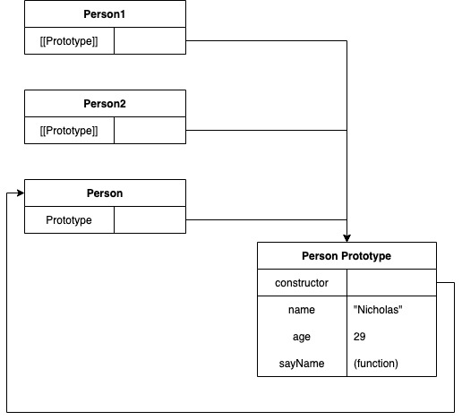
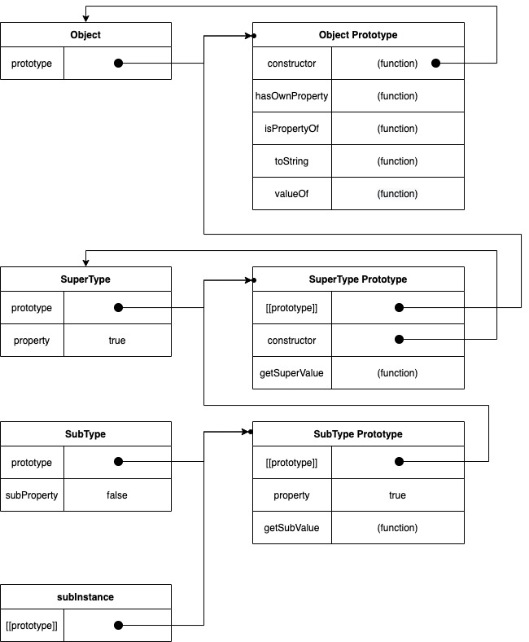

# 面向对象的程序设计

---

> ***关键词：对象、原型、继承、原型链、工场模式、组合模式、寄生模式、组合继承、寄生继承、寄生组合继承***

## 1. 理解对象

```javascript
var person = {
  name: 'kenny',
  age: 29,
  sayName: function () {
    alert(this.name) // Object中可直接创建对象
  }
}
```

### 1.1. 属性类型 - 数据属性、访问器属性

- ***数据属性*** - 包含一个数据值的位置。该位置可进行读取和写入

  | 属性值             | 定义                                                | 默认值    |
  | ------------------ | --------------------------------------------------- | --------- |
  | `[[Configurable]]` | 能否修改属性的特性，一旦修改为false，则再也无法恢复 | true      |
  | `[[Enumerable]]`   | 能否通过for-in循环返回属性                          | true      |
  | `[[Writable]]`     | 能否修改属性的值                                    | true      |
  | `[[Value]]`        | 该属性的数据值                                      | undefined |

  用`Object.defineProperty()`可以对属性进行修改：（但是慎重使用）

  ```javascript
  var person = {}
  Object.defineProperty(person, 'name', {
    writable: false,
    value: 'Teller'
  })
  ```

- ***访问器属性*** - 不包含数据值，包含getter和setter

  | 属性值             | 定义                                                | 默认值    |
  | ------------------ | --------------------------------------------------- | --------- |
  | `[[Configurable]]` | 能否修改属性的特性，一旦修改为false，则再也无法恢复 | true      |
  | `[[Enumerable]]`   | 能否通过for-in循环返回属性                          | True      |
  | `[[Get]]`          | 读取属性时调用                                      | undefined |
  | `[[Set]]`          | 写入属性时调用                                      | undefined |


### 1.2 定义多个属性 - `Object.defineProperties()`

```javascript
var book = {}

Object.defineProperties(book, {
  _year: {
    writable: true,
    value: 2004
  },
  
  edition: {
    writable: true,
    value: 1
  },
  
  year: {
    get: function() {
      return this._year
    }
  }
})
```


### 1.3 读取属性的特性 - `Object.getOwnPropertyDescriptior()`

> 任何DOM和BOM对象均可使用该方法，获取对象属性

```javascript
var descriptor = Object.getOwnPropertyDescriptior(book,  '_year')

alert(descriptor.value) // 2004
alert(descriptor.configurable) // false
```


## 2. 创建对象

### 2.1 工厂模式 

> 工厂模式 - 用函数封装构造整个函数的过程
>
> 存在问题：无法使用instanceof识别对象的类型（Array这些）

```javascript
function createPerson (name, age, job) {
  var o = new Object()  // 需要创建新对象
  o.name = name
  o.age = age
  o.job = job
  o.sayName = function () {
    alert(this.name)
  }
  return o // 需要return这个对象
}

var person1 = createPerson('Greg', 27, 'Doctor')
```

### 2.2 构造函数

先看下面改造的例子：

```javascript
// 构造函数Person - 将属性和方法直接赋值给this对象，无需return
function Person (name, age, job) {
  this.name = name
  this.age = age
  this.job = job
  this.sayName = function() {
    alert(this.name)
  }
}

// 用new方法，使用构造函数，创建person对象
var person1 = new Person('Greg', 29, 'Doctor')

// 用构造函数创建的对象，可以通过instanceof，获取到对象的类型
alert(person1 instanceof Person) // true
```

> 与工厂模式的区别：
> 1. 没有显式的创造对象
> 2. 直接将属性和方法给了this对象
> 3. 没有return语句

- 将构造函数当做函数

  ```javascript
  // 构造函数与其他函数最大的区别：调用方式不同
  // 1. 作为构造函数使用
  var person1 = new Person('Greg', 29, 'Doctor')
  person1.sayName() // 'Greg'
  
  // 2. 作为普通函数调用 - 相当于给window创建一个对象
  Person('Greg', 29, 'Doctor')
  window.sayName() // 'Greg'
  
  // 3. 在另一个对象的作用域中调用
  var o = new Object()
  Person.call(o, 'Greg', 29, 'Doctor')
  o.sayName() // 'Greg'
  ```

- 构造函数的缺点：每个方法都要在每个实例上重新创建一遍

  ```javascript
  // 创建构造函数
  function Person (name, age, job) {
    this.name = name
    this.age = age
    this.job = job
    this.sayName = new function("alert(this.name)") {}// 与声明函数等价
  }
  
  // 通过Person构造的两个对象的sayName()是不等价的，但两者执行的功能是一致的
  alert(person1.sayName == person2.sayName) // false
    
  // 一个不太好的解决方案：将sayName()移出来，做成全局的function
  function Person (name, age, job) {
    this.name = name
    this.age = age
    this.job = job
    this.sayName = sayName
  }
  function sayName() {
    alert(this.name)
  }
  // 缺点：如果一个对象需要有多个function，就要全局声明多个function，违反了封装性
    
  // 更好的解决方法：原型模式（prototype）↓↓↓↓↓↓↓↓↓↓↓↓↓↓
  ```

  

### 2.3 原型模式

  >1. 每一个创建的函数、Object都有一个prototype属性
  >2. prototype属性是一个指针，指向一个对象，包含由特定类型的所有实例共享的属性核方法
  >3. 好处：让所有对象实例均可共享其所包含的属性和方法，而无需在构造函数中定义对象实例的信息

  ```javascript
  function Person() {} // 构造函数Person
  
  // 在Person的原型中添加属性,而非在构造函数中添加
  Person.prototype.name = 'Nicholas'
  Person.prototype.name = 29
  Person.prototype.sayName = function () { alert(this.name) }
  
  // 创建对象 - 使用Person构造函数创建Person对象，该对象可以直接使用Person中的原型属性
  var person1 = new Person()
  person1.sayName() // 'Nicholas'
  
  var person2 = new Person()
  person2.sayName() // 'Nicholas'
  
  alert(person1.sayName == person2.sayName) // true - 创建不同对象时，均指向同一个原型属性（同一个指针）
  ```

#### 2.3.1 理解原型对象



>1. Person Prototype - 原型对象：包含构造函数constructor和属性值：name、age、sayName
>2. Person 构造函数：原型Prototype指向整个Person原型对象；原型对象中的构造函数指回了Person构造函数
>3. 利用Person构造函数创建的Person1和Person2对象：包含一个[[Prototype]]属性，该属性指向的就是Person原型对象
>
>所以，Person1和Person2对象，均指向的是同一个原型对象中的sayName属性

  1. 创建一个新函数function，就会为该函数创建一个prototype属性，该属性指向函数的原型对象

  2. 所有的原型对象都会自动获得一个constructor属性，该属性是一个指向prototype属性所在函数的指针（注意：指针）

  3. 通过构造函数创建一个对象后，该对象内部将包含一个`[[prototype]]`指针，指向构造函数的原型对象

  4. 可以通过`isPrototype()`和`Object.getPrototypeOf()`方法确定对象是否指向构造函数（因为在常规实现中无法访问）：

     ```javascript
     // 1. 用isPrototype()方法确定对象和构造函数之间关于prototype的关系
     Person.prototype.isPrototypeOf(person1) // true
     
     // 2. 用es5提出的Object.getPrototypeOf()来返回[[Prototype]]的值
     Object.getPrototypeOf(person1).name // 'Nicholas'
     Object.getPrototypeOf(person1) == Person.prototype // true
     ```

5. 无法通过对象实例重写原型中的值，只能通过在实例中创建同名的该属性，以屏蔽原型中的属性

     ```javascript
     // 1. 创建构造函数Person
     function Person() {}
     
     // 2. 创建Person的原型对象
     Person.prototype.name = 'Nicholas'
     Person.prototype.age = 29
     Person.prototype.job = 'Doctor'
     Person.prototype.sayName = function() { alert(this.name) }
     
     // 3. 创建Person的对象person1
     var person1 = new Person()
     
     // 4. 在实例（constructor）中创建name属性值
     person1.name = 'Greg'
     
     // 5. 实例中的name属性覆盖掉prototype中的name属性
     alert(person1.name) // 'Greg'
     
     // 6. 通过delete删除实例中的属性值
     delete person1.name
     
     // 7. 由于删除了实例中的属性，所以调用时候会展示原型中的属性值
     alert(person1.name) // 'Nicholas'
     ```

     

#### 2.3.2 原型与in操作符 - 通过枚举判断属性是否在原型或实例中

1. 判断属性是否来自于实例：`hasOwnProperty()` - 来自于实例中则返回true

   ```javascript
   var person1 = new Person()
   
   // 1. name属性来自于原型中，故返回false
   alert(person1.hasOwnProperty('name')) // false
   
   // 2. 创建实例中的属性，则检测后返回true
   person1.name = 'Greg'
   alert(person1.hasOwnProperty('name')) // true
   ```

2. 判断属性是否来自于实例或对象：`hasOwnProperty()`、单独使用in操作符、`hasPrototypeProperty()`

   ```javascript
   var person1 = new Person()
   
   // 1. 用in方法确认name属性是否存在于实例或原型中
   alert('name' in person1) // true --- name属性存在于实例或原型中
   
   // 2. 用hasOwnProperty方法确认属性是否存在于实例中
   alert(person1.hasOwnProperty('name')) // false --- name属性不存在于实例中
   
   // 3. 用hasOwnProperty和in结合的方法，判断属性是否存在于原型中
   alert(!Person.hasOwnProperty('name') && (name in Person)) // true --- name属性存在于原型中
   
   // 4. 利用上述方法，封装一个hasPrototypeProperty方法，判断属性是否存在于原型中
   function hasPrototypeProperty(object, name) {
     return !object.hasPrototypeProperty(name) && (name in object)
   }
   alert(hasPrototypeProperty(person, 'name')) // true --- name属性存在于原型中
   ```

3. 通过for-in方法可访问Enumerated为true的属性值，但会屏蔽Enumerated为false的值

   ```javascript
   // 通过Object.keys()方法，返回包含所有可枚举属性的字符串数组
   var keys = Object.keys(Person.prototype)
   alert(keys) // 'name, age, job, sayName'
   
   // 通过Object.getOwnPropertyNames()方法，返回所有实例属性（无论是否可枚举）
   var keys2 = Object.getOwnPropertyNames(Person.prototype)
   alert(keys2) // 'constructor, name, age, job, sayName' --- constructor不可枚举，但可以通过该方法获取
   ```

#### 2.3.3 一个对原型更简单优雅的写法 - 对象字面量方法

```javascript
// 1. 原方法
// 1.1 创建构造函数Person
function Person() {} 
// 1.2 创建Person的原型对象
Person.prototype.name = 'Nicholas'
Person.prototype.age = 29
Person.prototype.job = 'Doctor'
Person.prototype.sayName = function() { alert(this.name) }

// 2. 优雅的方法：对象字面量方法
function Person() {}
Person.prototype = {
  name: 'Nicholas',
  age: 29,
  job: 'Doctor',
  sayName: function() {
    alert(this.name)
  }
}

// 3. 对象字面量方法带来的问题：prototype对象的constructor属性，不再指向Person
/* 原因：
 * 通过上述方法，完全重写了默认的prototype对象，
 * 所以constructor属性变成了新对象的constructor属性，指向Object构造函数，而非Person函数
 */
var person1 = new Person()
alert(person1 instanceof Object) // true
alert(person1 instanceof Person) // true
alert(person1.constructor == Person ) // false - person1对象的构造函数因为重写prototype对象，所以直接指向了Object
alert(person1.constructor == Object) // true
// 3.1 处理上述问题的方法：在重写的对象中也把constructor进行赋值返回
Person.prototype = {
  constructor: Person, // 在重写的原型对象中，把Person设置为constructor的值
  name: 'Nicholas',
  age: 29,
  job: 'Doctor',
  sayName: function() {
    alert(this.name)
  }
}
// 3.2 但上述方法会导致constructor变成可枚举的值，需要用defineProperty方法进行设置
Object.defineProperty(Person.prototype, 'constructor', {
  enumerable: false, // 重置为false
  value: Person
}) 
```


#### 2.3.4 原型的动态性 - 动态添加属性

> 对原型对象所做的任何修改可立即在实例中反映出来

```javascript
// 1. 直接创建对象friend
var friend = new Person()

// 2. 然后为Person添加原型对象属性sayHi
Person.prototype.sayHi = function() {
  alert('Hi')
}

// 3. 对象friend可以使用新添加的属性值
friend.sayHi() //'Hi'
```

- 但是！如果是是重写原型对象，就会切断构造函数和最初原型对象的关系，因为实例中的指针是指向原型，而非构造函数

  ```javascript
  // 1. 直接创建对象friend
  var friend = new Person()
  
  // 2. 然后为Person重写原型对象，包含属性sayHi
  Person.prototype = {
    constructor: Person, // 在重写的原型对象中，把Person设置为constructor的值
    name: 'Nicholas',
    age: 29,
    job: 'Doctor',
    sayName: function() {
      alert(this.name)
    }
  }
  
  // 3. 对象friend不能使用通过重写原型对象而新添加的属性值，因为Person本身指向了一个全新的prototype对象，而非friend指向的原有的原型对象
  friend.sayHi() //error
  ```


#### 2.3.5 原生对象的原型

- 所有的原生的引用类型，都是上述模式创建的，具备原型模式。
- 例如：Array.prototype中可以找到sort方法；String.prototype中可以找到substring方法
- 可以随时给原生对象添加新的原型方法，但是不推荐使用


#### 2.3.6 原型对象的问题 - 共享属性导致的问题

```javascript
// 创建构造函数Person
function Person() {}

// 创建原型对象，其中包含引用类型friends（Array）
Person.prototype = {
  constructor: Person, // 在重写的原型对象中，把Person设置为constructor的值
  name: 'Nicholas',
  age: 29,
  job: 'Doctor',
  friends: ['Sheldon', 'Raj']
  sayName: function() {
    alert(this.name)
  }
}

var person1 = new Person()
var person2 = new Person()

// person1对象中，为引用对象属性friends赋值
person1.friends.push('Penny')

// 由于原型对象的共享性，所以所有通过Person()构造函数创建的对象，都具备相同的原型对象属性，原型对象中的引用对象会指向同一个值
alert(person1.friends) // 'Sheldon, Raj, Penny'
alert(person1.friends) // 'Sheldon, Raj, Penny'
alert(person1.fiends === person2.friends) // true
```

- 由于上述原因，一般很少将特殊的非共享同一个值的属性放在原型对象中，而是放在实例（构造函数）中进行声明


### 2.4 组合使用构造函数模式和原型模式

>构造函数模式用于定义实例属性
>
>原型模式用于定义方法和共享的属性
>
>最大限度节省内存

```javascript
// 创建构造函数Person
function Person(name, age, job) {
  this.name = name
  this.age = age
  this.job = job
  this.friends = ['Sheldon', 'Raj']
}

// 创建原型对象
Person.prototype = {
  constructor: Person, 
  sayName: function() {
    alert(this.name)
  }
}

var person1 = new Person('Nicholas', 29, 'Doctor')
var person2 = new Person('Cindy', 28, 'Developer')
person1.friends.push('Van')

alert(person1.friends === person2.friends) // false
alert(person1.sayName === person2.sayName) // true
```


### 2.5 动态原型模式

> 可以通过检查某个应该存在的方法是否有效，来决定是否需初始化原型

```javascript
function Person(name, age, job) {
  this.name = name
  this.age = age
  this.job = job
  this.friends = ['Sheldon', 'Raj']
}

// 仅在sayName不存在的情况下，才将其添加到原型中
if (typeof this.sayName != 'function') {
  Person.prototype.sayName = function() {
    alert(this.sayName)
  }
}

// 使用动态原型模式时，不能使用对象字面量重写原型。因为已经创建了实例的情况下重写原型，会切换现有实例和新原型之间的关系
```


### 2.6 寄生构造函数模式 -非必要情况下， 不推荐使用

> 创建一个函数，该函数的作用仅为封装创建对象的代码，再返回新创建的对象
>
> 可以使用new操作符，包装函数可称为构造函数
>
> 该模式可以在特殊的情况下为对象创建构造函数，例如不能直接修改Array构造函数，但可以使用该模式添加特殊方法

- 样例1：
```javascript
// 寄生构造函数模式 - 类似工厂模式
function Person(name, age, job) {
  var o = new Object() // 创建对象
  o.name = name
  o.age = age
  o.job = job
  o.sayName = function () {
    alert(this.name)
  }
  return o // 返回对象
  // 如果不设置返回值，则默认会返回新对象实例；故可以在寄生模式中重写返回值
}

// 可以使用new操作符创建，因为上述方法可以被认为是构造函数
var friend = new Person('Nicholas', 29, 'doctor')
friend.sayName() // 'Nicholas'
```

- 样例2：
```javascript
// 不能修改Array构造函数，但是恶意使用寄生模式为对象添加构造函数
function SpecialArray () {
  // 创建数组
  var values = new Array()
  
  // 添加值
  values.push.apply(values, arguments)
  
  // 添加方法
  values.toPipedString = function () {
    return this.join('|')
  }
  
  // 返回数组
  return values
}

var colors = new SpecialArray('red', 'blue', 'green')
alert(colors.toPipedString()) // 'red|blue|green'
```

注意：
- 返回的对象与构造函数或者与构造函数的原型属性之间，没有关系
- 构造函数但会的对象，与在构造函数外部创建的对象相同
- 不能依赖instanceof来确定对象的值


### 2.7 稳妥构造函数模式

> 稳妥对象：没有公共属性，方法不引用this的对象，适合在安全环境中使用（安全模式下禁止this和new）
>
> 与寄生模式相似，不同点如下：
>
> 1. 新创建对象的实例方法不引用this
> 2. 不使用new操作符调用构造函数
>
> 注意：稳妥模式下不能使用对象字面量重写原型，原因同上

```javascript
function Person(name, age, job) {
  // 创建对象
  var o = new Object() 
  o.name = name
  o.age = age
  o.job = job
  
  // 不使用this对象
  o.sayName = function () {
    alert(name) 
  }
  
  // 返回对象
  return o 
}

var friend = new Person('Nicholas', 29, 'doctor')

// 除了使用Person中的sayName，不能通过其他方法获取name，故适合安全环境
friend.sayName() // 'Nicholas'
```


## 3. 继承 - 原型链

- ***补充知识***：JAVA的接口继承与实现继承 - 参考CSDN文档：[接口和抽象类详解（接口继承、实现接口、抽象类继承）](https://blog.csdn.net/lemo_ice/article/details/100690860?utm_medium=distribute.pc_relevant.none-task-blog-2%7Edefault%7EBlogCommendFromMachineLearnPai2%7Edefault-3.baidujs&dist_request_id=1331645.9537.16183873438248735&depth_1-utm_source=distribute.pc_relevant.none-task-blog-2%7Edefault%7EBlogCommendFromMachineLearnPai2%7Edefault-3.baidujs)

  - 实现继承：继承实际的方法；

  ```java
  // 定义一个bird类，其中包含公共方法fly()
  public class bird {
    public void fly()
  }
  
  // 通过extends使eagle类继承实现bird类，并重写fly()
  // 注意：extends后只能继承一个类
  public class eagle extends bird {
    @override
    public void fly()
  }
  ```

  

  - 接口继承：只继承方法和签名；

  ```java
  // 定义接口1
  public interface ServeBall {
  	public void ServeBalls();
  }
  
  // 定义接口2
  public interface GiveBirth {
  	public void HaveBaby();
  }
  
  // 接口继承方法1：通过implements使新建的类实现上述两个接口，并对其中方法进行重写（继承多个接口）
  public class WomenBasketballPlayer implements ServeBall,GiveBirth {
  	@Override
  	public void HaveBaby() {
  		// TODO Auto-generated method stub
  	}
  
  	@Override
  	public void ServeBalls() {
  		// TODO Auto-generated method stub
  	}
  }
  
  // 接口继承方法2：接口继承接口：
  public interface GiveBirth extends ServeBall{
  	public void HaveBaby();
  }
  
  /*
   * ————————————————
   * 版权声明：本文为CSDN博主「lemo_ice」的原创文章，遵循CC 4.0 BY-SA版权协议，转载请附上原文出处链接及本声明。
   * 原文链接：https://blog.csdn.net/lemo_ice/article/details/100690860
   */
  ```

- ***JavaScript只支持实现继承，并依靠原型链实现***（原因：JavaScript的function没有签名，无法进行接口实现）

  > 关于Java中的方法签名：
  >
  > ***Definition: Two of the components of a method declaration comprise the method signature—the method’s name and the parameter types.***
  >
  > - 方法签名的组成：方法名称+参数类型；例如：calculate(value1, value2)
  >
  > - 意义：用于重载 -  方法签名是可以唯一的确定一个method，与method的返回值一点关系都没有，这是判断重载重要依据
  >
  > - ```java
  >   // 不允许的写法：方法签名完全相同，无法区分进行重载
  >   public long calculate() {}
  >   public int calculate() {}
  >   
  >   // 允许的写法：方法签名不同
  >   public long calculate(value1, value2, value3) {}
  >   public long calculate2(value1, value2, value3)
  >   public long calculate2(value1, value2) {}
  >   ```
  >
  > - 备注：如前文（基本概念）中提过，javascript中并不支持重载，因为后定义的函数会覆盖之前名称相同的函数
  >
  >   
  >
  > 参考文档：
  >
  > [JAVA中 什么是方法签名？](https://blog.csdn.net/liu_sisi/article/details/88368846)
  >
  > [Java方法签名](https://blog.csdn.net/qiuchengjia/article/details/52910884)

### 3.1 原型链

- 举个栗子：

```javascript
// 1. 定义一个父类型 SuperType
// 1.1 创建SuperType的构造函数，其中包含属性值property: true
function SuperType() {
  this.property = true
}
// 1.2 设置SuperType的原型对象，添加方法getSuperValue()
SuperType.prototype.getSuperValue = function () {
  return this.property
}

// 2. 定义一个子类型 SubType
// 2.1 创建SubType的构造函数，其中包含属性值subProperty: false
function SubType() {
  this.subProperty: false
}
// 2.2 使SubType继承SuperType的方法和原型（通过构造函数SuperType）
SubType.prototype = new SuperType()
// 2.3 重写SubType的原型对象，添加方法getSubValue()
SubType.prototype.getSubValue = function () {
  return this.subProperty
}

// 3. 创建SubType的实例，可见该实例继承了SuperType的方法和属性
var subInstance = new SubType()
alert(subInstance.getSuperValue()) // true

// 注意：本质上，SuperType作为引用类型，也继承了Object，所以Object的属性和方法存在于SuperTye的原型对象中。从而构成原型链。
```

- 解析上述原型链：SubType继承了SuperType，SuperType继承了object

  > 1. 创建一个SubType的实例：subInstance
  >
  > 2. subInstance实例中包含一个`[[prototype]]`指针，指向了SubType的原型对象
  >
  > 3. SubType的原型对象由于继承的关系，使用new方法，创建SuperType的实例并赋值给了`SubType.prototype`，所以SuperType中的所有属性和方法，此时也存在与SubType.prototype中，例如：`property`、`getSuperValue()`
  >
  > 4. 同时，SubType中可以添加属于自身的属性和方法，例如：`subProperty`、`getSubValue()`
  >
  > 5. SuperType也是继承于Object，所以Object的属性和方法存在于`[[SuperType.prototype]]`中
  >
  > 6. 由于继承，故Object的属性和方法可以在`[[SubType.prototype.prototype]]`中找到
  >
  > 7. 所以，实例subInstance可以调用自身的方法、SuperType的方法、Object的方法：
  >
  >    ```javascript
  >    subInstance.getSubValue() // false
  >    subInstance.getSuperValue() // true
  >    subInstance.toString()
  >    ```

  

- 确定原型和实例的关系：

  ```javascript
  // 方法1： instanceof
  alert(subInstance instanceof Object)    // true
  alert(subInstance instanceof SubType)   // true
  alert(subInstance instanceof SuperType) // true
  
  // 方法2：isPrototypeOf()
  alert(Object.prototype.isPrototypeOf(subInstance))    // true
  alert(SubType.prototype.isPrototypeOf(subInstance))   // true
  alert(SuperType.prototype.isPrototypeOf(subInstance)) // true
  ```

- 谨慎使用定义方法

  > 给原型添加方法的代码一定是在替换原型的语句之后：
  >
  > 1. 先使用new方法替换原型实现继承，再添加新的方法或重写方法
  > 2. 不能使用对象字面量创建原型方法、

  ```javascript
  // SubType继承SuperType - SubType的prototype替换为SuperType的实例
  SubType.prototype = new SuperType()
  
  // 添加新方法
  SubType.prototype.getSubValue = function () {
    return false
  }
  
  // 重写父类中的方法
  SubType.prototype.getSuperValue = function () {
    return false
  }
  
  var subInstance = new SubType()     // 创建SubType实例
  var superInstance = new SuperType() // 创建SuperType实例
  
  subInstance.getSuperValue()   // false - 子类中的方法已被重写
  superInstance.getSuperValue() // true - 父类中的原方法不受影响
  
  // 使用对象字面量添加新方法，会切断SubType和SuperType之间的联系
  // 因为再次重写了整个prototype，使其仅包含一个object的实例，所以再也无法调用SuperType中的属性和方法
  SubType.prototype = {
    getSubValue: function() {
      return this.subProperty
    },
    someOtherMethod: function() {
      return false
    }
  }
  var otherInstance = new SubType
  alert(otherInstance.getSuperValue()) // error!
  ```

- 原型链的问题 - 解决方法：借用构造函数↓↓↓

  1. 包含引用类型的值的原型 - 父类实例属性中如果包含一个引用类型值，则通过继承后，会变成子类的原型属性
  2. 创建子类时，无法在不影响所有对象实例的情况下，向父类的构造函数中传参，故很少单独使用原型链

  ```javascript
  // 创建父类，其中包含实例属性colors
  function SuperType () {
    this.colors = ['red', 'green', 'blue']
  }
  
  // 创建子类
  function SubType() {}
  
  // 子类继承父类 - 父类中的实例属性colors会变成原型属性，成为共享属性
  SubType.prototype = new SuperType()
  
  var instance1 = new SubType()
  var instance2 = new SuperType()
  
  // 由于引用对象是原型属性，所以对子类继承到的引用对象进行改变，会影响到父类自身的实例属性
  instance1.colors.push('black')
  alert(instance1.colors) // 'red, green, blue, black'
  alert(instance2.colors) // 'red, green, blue, black'
  ```


### 3.2 借用构造函数 constructor stealing

> ***基本思想：***
>
> 在子类型构造函数的内部调用超类型构造函数完成继承 - 用call或apply实现

```javascript
// 创建父类，其中包含实例属性colors
function SuperType () {
  this.colors = ['red', 'green', 'blue']
}

// 创建子类 - 使用call或者apply的方法，在子类的构造函数上，继承父类SuperType
function SubType() {
  SuperType.call(this) // 继承
}

var instance1 = new SubType()
var instance2 = new SuperType()

// 新创建的SubType实例中，调用SuperType构造函数，
// 则是在新的SubType对象上执行SuperType()中定义的初始化代码，则让SubType的每个实例都拥有自己的colors属性副本
instance1.colors.push('black')
alert(instance1.colors) // 'red, green, blue, black'
alert(instance2.colors) // 'red, green, blue' - 原有父类的实例属性不受影响
```

- 传递参数 - 子类构造函数中，可向父类构造函数传递参数

```javascript
// 创建父类，父类构造函数需传参
function SuperType (name) {
  this.name = name
}

// 创建子类
// 注意：先继承，再添加或修改属性
function SubType () {
  // 继承SuperType，同时进行传参
  SuperType.call(this, 'Nicholas')
  
  // 创建自身的实例属性
  this.age = 29
}

var instance = new SubType()
alert(instance.name) // 'Nicholas'
alert(instance.age)  // 29
```

- 借用构造函数的问题 - 本质：构造函数问题 ---- 解决方法：组合继承↓↓↓↓

> function都在构造函数中定义，因此缺乏函数复用性；故借用构造函数模式也很少使用


### 3.3 组合继承 combination inheritance

> ***基本思路：***
>
> 使用原型链实现对原型属性和方法的集成，通过借用构造函数来实现对实例属性的集成，从而保证原型中的方法可以复用，又能保证每个实例有自己单独的属性
>
> ***存在的问题：***
>
> 调用两次父类构造函数 - 解决方案：寄生组合式继承

```javascript
// 创建父类，包含实例属性和原型方法
function SuperType(name) {
  this.name = name
  this.colors = ['red', 'green', 'blue']
}
SuperType.prototype.sayName = function () {
  alert(this.name)
}

// 创建子类
function SubType (name, age) {
  // 继承实例属性
  SuperType(this, name)
  
  // 创建子类实例属性
  this.age = age
} 

// 子类继承父类原型方法
// 注意：不能使用对象字面量，否则将覆盖掉继承的属性和方法，切断继承联系
// 1. 继承父类
SubType.prototype = new SuperType()
// 2. 将继承后，原型中的constructor重写，指回SubType本身的constructor，而不是让其默认指向父类SuperType的constructor
SubType.prototype.constructor = SubType
// 3. 给继承后的原型添加方法sayAge
SubType.prototype.sayAge = function () {
  alert(this.age)
}

// 创建一个子类型的实例instance1，其具备独立的实例属性：name、age、colors，其中name和colors继承于父类
var instance1 = new SubType('Nicholas', 29)
instance1.colors.push('black')
alert(instance1.colors) // 'red, green, blue, black'
instance1.sayName()     // Nicholas
instance1.sayAge()      // 29

// 创建另一个子类型实例，其他同类实例的改变不会对该实例造成影响，各个实例具备独立的实例属性
var instance2 = new SubType('Cindy', 27)
alert(instance2.colors) // 'red, green, blue'
instance2.sayName()     // Cindy
instance2.sayAge()      // 27
```


### 3.4 原型继承 Prototypal Inheritance

> 本质：浅拷贝原型及属性
>
> 注意：该方法存在引用类型的问题，故不会直接使用，但是给了解决上面组合继承的问题的一个思路

```javascript
// 将对象进行浅拷贝的方法：
function object(o) {
  function F ()   // 1. 创建临时构造函数
  F.prototype = o // 2. 将传入的对象o作为这个临时构造函数的原型
  return new F()  // 3. 返回该临时类型的实例
}

// 使用样例：
// 1. 创建一个普通对象
var obj = {
  name: 'showColor',
  colors: ['red', 'green', 'blue']
}

// 2. 使用object()方法对obj对象进行浅拷贝 - obj对象作为新的实例的原型对象，故obj中原有属性现在均为原型属性进行共享
var obj2 = object(person)
obj2.name = 'anotherColor'
obj2.colors.push('black') // colors现在属于原型对象，所以colors现在是共享状态的，任何改变都会对原本的对象进行改变

alert(obj.colors) // 'red, green, blue, black, pink'
```

- es5提供了`Object.create()`方法，可以传入两个参数

  > 参数1：用作新对象原型的对象
  >
  > 参数2：为新对象定义定义额外属性的对象（可重写覆盖原有同名属性）

```javascript
// 1. 创建一个普通对象
var obj = {
  name: 'showColor',
  colors: ['red', 'green', 'blue']
}

// 2. 只传第一个参数：使用官方的Object.create()方法对obj对象进行浅拷贝
var obj2 = Object.create(person)
obj2.name = 'anotherColor'
obj2.colors.push('black')
alert(obj.colors) // 'red, green, blue, black'

// 3. 传两个参数，对同名属性进行覆盖重写
var obj3 = Object.create(persn, { 
	name: {
    value: 'color2'
  }
})
alert(obj3.name) // color2
```


### 3.5 寄生式继承 Parasitic inheritance

> ***基本思路：***
>
> 寄生构造函数 + 工场模式 + 原型继承
>
> 创建一个仅用于封装继承过程的函数，该函数内部以某种方式增强对象，然后按照工厂模式的思路，返回整个对象
>
> 
>
> ***问题：***
>
> 函数无法复用，问题类似构造函数模式

```javascript
function createAnother (original) {
  // 1. 浅拷贝传入的对象
  var clone = object(original)
  
  // 2. 增强对象（例如：写入其他方法）
  clone.sayHi = function () {
    alert('Hi')
  }
  
  // 3. 返回这个对象
  return clone
}

// 创建对象
var obj = {
  name: 'showColor',
  colors: ['red', 'green', 'blue']
}

// 寄生继承上面的对象，新对象可以使用增强的内容
var obj2 = createAnother(obj)
obj2.sayHi() // hi
```


### 3.6 寄生组合式继承 - 最佳解决方案

#### 3.6.1 组合继承的问题：两次调用父类构造函数

```javascript
// 创建父类，包含实例属性和原型方法
function SuperType(name) {
  this.name = name
  this.colors = ['red', 'green', 'blue']
}
SuperType.prototype.sayName = function () {
  alert(this.name)
}

// 创建子类
function SubType (name, age) {
  SuperType(this, name) // 调用一次父类
  this.age = age
} 

SubType.prototype = new SuperType() // 调用第二次父类（可以用寄生组合的方式处理）

SubType.prototype.constructor = SubType
SubType.prototype.sayAge = function () {
  alert(this.age)
}
```

#### 3.6.2 寄生组合式继承的方法

> ***基本思路：***
>
> 不比为了指定子类的原型对象而调用父类的构造函数，只需建立父类原型的副本即可；
>
> 本质上，就是使用寄生式继承来继承父类原型，再将结果指定给子类原型；
>
> 组合继承 + 寄生继承（工厂模式+原型继承+寄生继承）

```javascript
// 寄生组合继承方法：
function inheritPrototype(subType, superType) {
  var prototype = Object.create(superType.prototype) // 1. 创建父类prototype的副本对象
  prototype.constructor = subType                    // 2. 增强副本对象，将子类构造函数添加覆盖
  subType.prototype = prototype                      // 3. 指定子类对象的原型为上面创建的副本对象
}

// 使用上述方法进行继承:
// 1. 创建父类，并添加原型方法sayName()
function SuperType(name) {
  this.name = name
  this.colors = ['red', 'green', 'blue']
}
SuperType.prototype.sayName = function() {
  alert(this.name)
}

// 2. 创建子类 - 通过寄生继承的方式，继承原型对象
function SubType(name, age) {
  // 调用一次父类构造函数，传入父类的实例属性
  SuperType.call(this, name) 
  this.age = age
}
// 使用寄生继承的方式，通过浅拷贝父类的原型对象，直接将副本指定给子类的原型对象，避免在SubType.prototype上创建不必要的属性
inheritPrototype(SubType, SuperType)  
SubType.prototype.sayAge = function () {
  alert(this.age)
}
```


